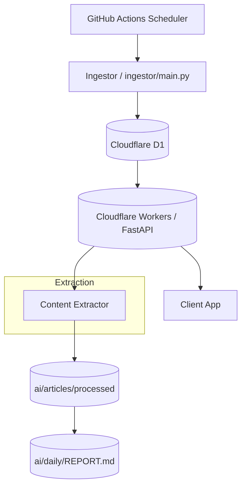
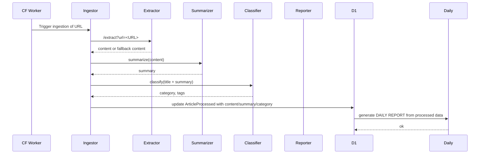
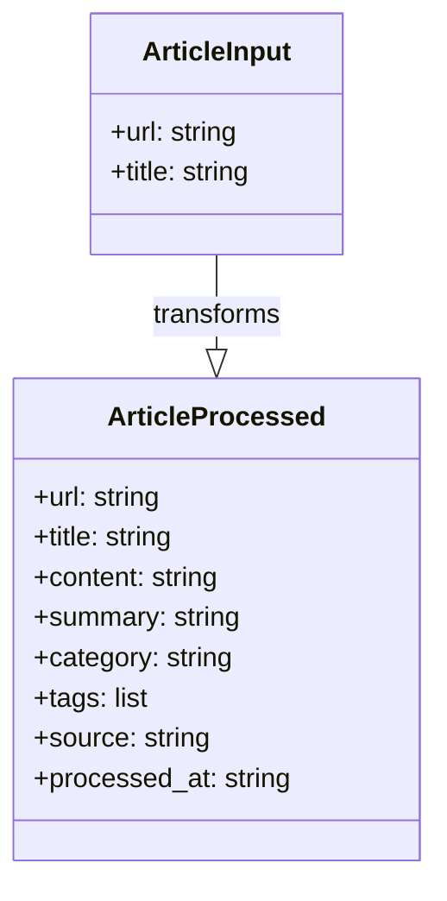

# Architecture Diagrams for AI Content Processing Pipeline (Baseline A)

These Mermaid diagrams visualize the baseline architecture and end-to-end data flow. They complement the textual architecture description and help with quick onboarding and reviews.

## 1) Deployment / Component Diagram (High level)

## 2) End-to-End Data Flow (Sequence)

## 3) Data Contracts / Entities

## 4) Notes
- 上述图可直接在 GitHub 的 Markdown 页面中渲染（Mermaid 支持）。
- 现阶段基线的实现点与这三张图保持一致：CF Worker 为入口，D1 为存储，内容提取、摘要、分类、日报等阶段的落地路径。可视化帮助团队理解数据流与依赖关系。
