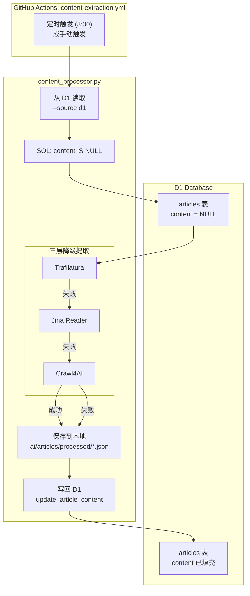
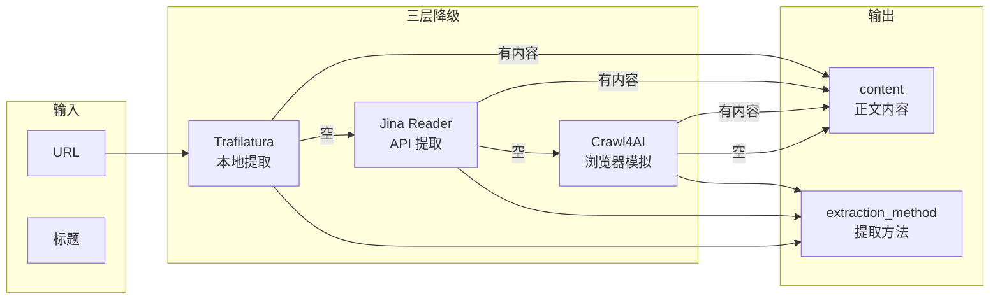
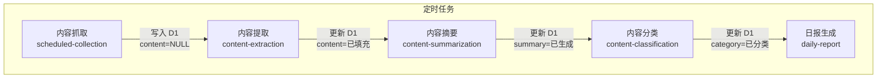
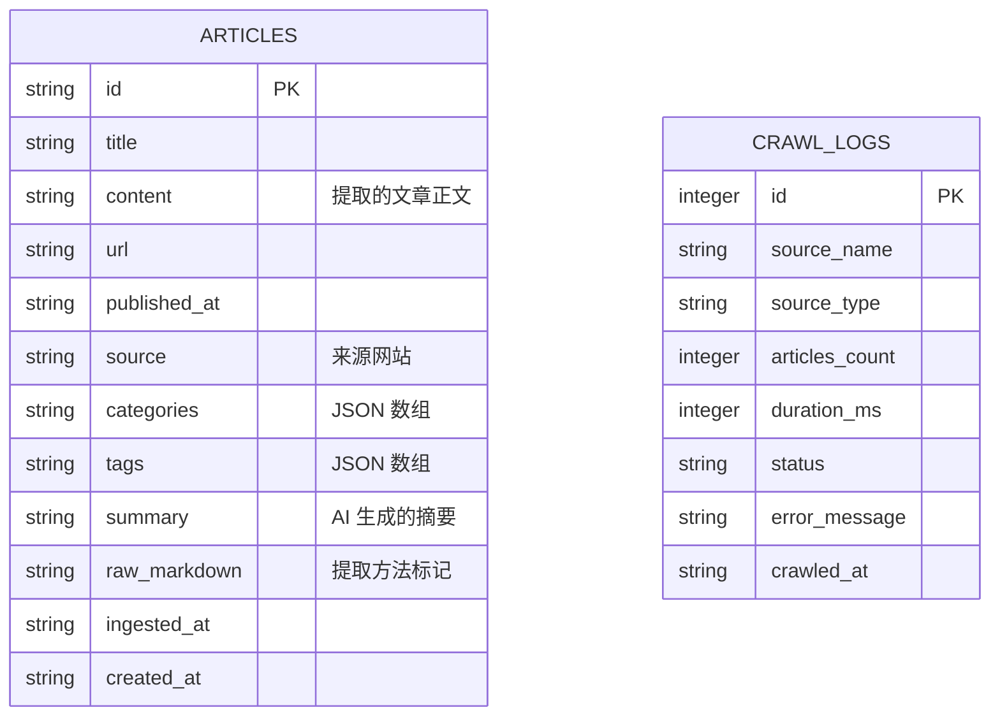

# AI Content Processing Pipeline

## 完整数据流



## 提取流程详情



## Workflow 触发链



## 数据字段映射



## 命令行参数

| 参数 | 说明 | 示例 |
|------|------|------|
| `--source` | 数据源 | `local` / `d1` |
| `--mode` | 处理模式 | `full` / `extract-only` / `summarize-only` / `classify-only` |
| `--d1-account-id` | Cloudflare 账户 ID | 从 `CF_ACCOUNT_ID` secrets 读取 |
| `--d1-database-id` | D1 数据库 ID | 从 `CF_D1_DATABASE_ID` secrets 读取 |
| `--d1-api-token` | API Token | 从 `CF_API_TOKEN` secrets 读取 |
| `--max-articles` | 最大处理数量 | 默认 30 |

## 典型使用场景

```bash
# 1. 从 D1 提取内容（GitHub Actions 自动）
python scripts/content_processor.py \
  --source d1 \
  --mode extract-only \
  --d1-account-id $CF_ACCOUNT_ID \
  --d1-database-id $CF_D1_DATABASE_ID \
  --d1-api-token $CF_API_TOKEN

# 2. 从本地文件提取内容（开发测试）
python scripts/content_processor.py \
  --source local \
  --mode extract-only \
  --input ai/articles/original

# 3. 完整处理流程
python scripts/content_processor.py \
  --source d1 \
  --mode full
```
