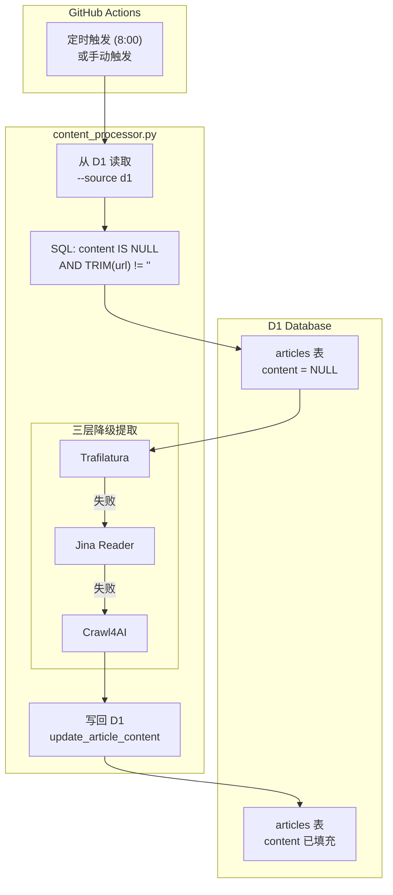
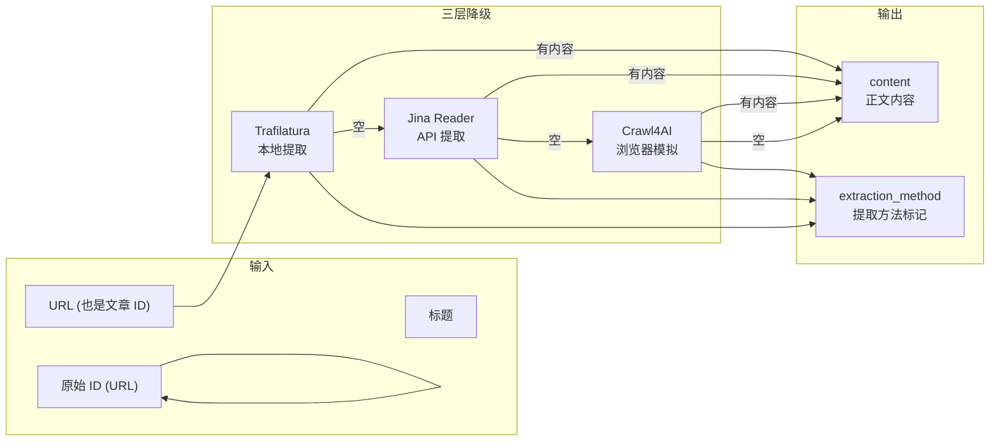
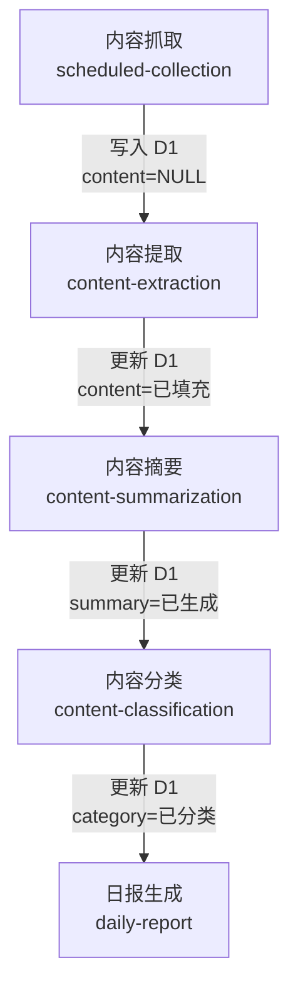

# AI Content Processing Pipeline

> 最后更新: 2026-02-27

## 完整数据流



## 提取流程详情



## Workflow 触发链



## 数据模型

### articles 表

| 字段 | 类型 | 说明 |
|------|------|------|
| id | TEXT PRIMARY KEY | **URL 作为主键**（如 `https://example.com/article`） |
| title | TEXT | 文章标题 |
| content | TEXT | 提取的文章正文 |
| url | TEXT | 文章 URL |
| published_at | TEXT | 发布时间 |
| source | TEXT | 来源网站 |
| categories | TEXT | JSON 数组 |
| tags | TEXT | JSON 数组 |
| summary | TEXT | AI 生成的摘要 |
| raw_markdown | TEXT | 提取方法标记（trafilatura/jina/crawl4ai） |
| ingested_at | TEXT | 抓取时间 |
| created_at | TEXT | 创建时间 |

### crawl_logs 表

| 字段 | 类型 | 说明 |
|------|------|------|
| id | INTEGER PK | 自增 ID |
| source_name | TEXT | 来源名称 |
| source_type | TEXT | 来源类型 |
| articles_count | INTEGER | 文章数量 |
| duration_ms | INTEGER | 耗时(毫秒) |
| status | TEXT | 状态 |
| error_message | TEXT | 错误信息 |
| crawled_at | TEXT | 抓取时间 |

## 命令行参数

```bash
python scripts/content_processor.py [OPTIONS]
```

| 参数 | 说明 | 默认值 |
|------|------|--------|
| `--source` | 数据源 | `local` |
| `--mode` | 处理模式 | `full` |
| `--input` | 输入目录 | `ai/articles/original` |
| `--output` | 输出目录 | `ai/articles/processed` |
| `--max-articles` | 最大处理数量 | 30 |
| `--d1-account-id` | Cloudflare 账户 ID | 环境变量 `CF_ACCOUNT_ID` |
| `--d1-database-id` | D1 数据库 ID | 环境变量 `CF_D1_DATABASE_ID` |
| `--d1-api-token` | API Token | 环境变量 `CF_API_TOKEN` |

### mode 选项

| 值 | 说明 |
|---|------|
| `full` | 完整流程：提取 + 摘要 + 分类 |
| `extract-only` | 仅提取内容 |
| `summarize-only` | 仅生成摘要 |
| `classify-only` | 仅分类 |

### source 选项

| 值 | 说明 |
|---|------|
| `local` | 从本地目录读取 `.md` 文件 |
| `d1` | 从 D1 数据库读取 |

## 使用示例

### 1. 从 D1 提取内容（生产环境）

```bash
python scripts/content_processor.py \
  --source d1 \
  --mode extract-only \
  --d1-account-id $CF_ACCOUNT_ID \
  --d1-database-id $CF_D1_DATABASE_ID \
  --d1-api-token $CF_API_TOKEN
```

### 2. 从本地文件提取（开发测试）

```bash
python scripts/content_processor.py \
  --source local \
  --mode extract-only \
  --input ai/articles/original
```

### 3. 完整流程

```bash
python scripts/content_processor.py \
  --source d1 \
  --mode full
```

## GitHub Secrets

运行 workflow 需要以下 Secrets：

| Secret | 说明 |
|--------|------|
| `CF_ACCOUNT_ID` | Cloudflare 账户 ID |
| `CF_D1_DATABASE_ID` | D1 数据库 ID |
| `CF_API_TOKEN` | Cloudflare API Token |

## 实现细节

### D1 API 返回格式

```json
{
  "result": [{
    "results": [...],
    "success": true,
    "meta": {...}
  }],
  "success": true
}
```

需要通过 `result['result'][0]['results']` 获取实际数据。

### 三层降级策略

1. **Trafilatura** - 本地 HTML 解析（最快）
2. **Jina Reader** - API 提取（`r.jina.ai/{url}`）
3. **Crawl4AI** - 浏览器模拟（最慢但最鲁棒）

### 文章 ID 设计

- 使用 **URL 作为主键**（保证唯一性）
- 原始 ID 在提取时被保留，用于更新 D1 记录
